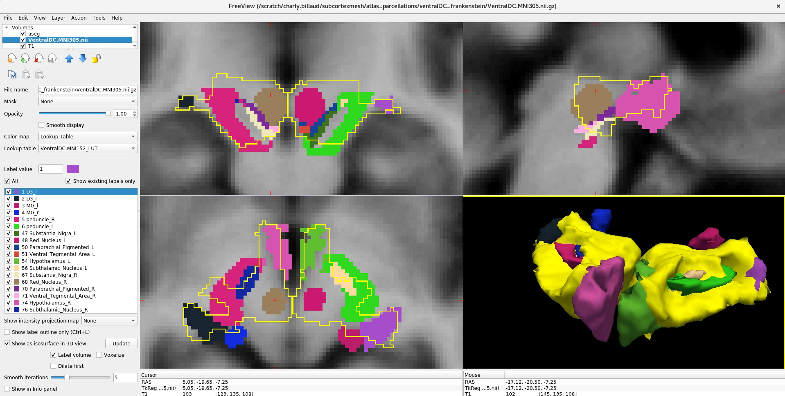

# Ventral DC Frankenstein atlas

This is a brute fusion of multiple atlases' regions stitched up together to fit in the "ventral diencephalon" (ventral DC), a region of interest included in FreeSurfer (Fischl, 2012)'s [automated subcortical segmentation](https://surfer.nmr.mgh.harvard.edu/fswiki/SubcorticalSegmentation) (ASeg), in MNI space. Its purpose is to help users interpet the ventral diencephalon's anatomy in more details given it encompasses multiple nuclei. It is NOT meant to be a precise subsegmentation but mostly a broad reference.

The ventral DC is [documented](https://surfer.nmr.mgh.harvard.edu/fswiki/SubcorticalSegmentation) to include the following:

> "[...] "ventral diencephalon" region that subtends many of the smaller nuclei and structures in the area inferior to the thalamus, such as hypothalamus, red nuclei, later and medial geniculate, etc. [...] As defined by Makris in Makris, et al. Biol Psychiatry. 2008 Aug 1;64(3):192-202. (paper "...ventral diencephalon (49), which according to our morphometric definition contains the hypothalamus, basal forebrain, and sublenticular extended amygdala (SLEA), as well as a large portion of ventral tegmentum (which is included in our ventral diencephalon region by convention although part of midbrain)"

The stitched up regions roughly match the underlying volume (overlapped using FreeSurfer's freeview):

The remaining empty space is most likely white matter fibers extending from the brainstem. The cerebral peduncles tracts in particular, although defined slimmer in the JHU DTI, make up the anterior space of the ventral DC.

# Atlas regions used to build it

**Substantia Nigra, Red Nucleus, Parabrachial Pigmented, Ventral Tegmental Area,Hypothalamus,Subthalamic Nucleus**, from the CIT68 Reinforcement Learning Atlas (Pauli et al. 2018; OSF data: https://doi.org/10.17605/OSF.IO/R2HVK), using the MNI 152 space ("CIT168_Reinf_Learn_v1.1.0/MNI152-Nonlin-Asym-2009c/CIT168toMNI152-2009c_det.nii").

Note: The atlas was split to distinguish left and right ROIs (see repository script code/CIT168_splitter.py). The Mammillary nucleus was dropped as identified to be mostly out of the ventral DC. MGN kept as documented to be part of ventral DC, even though the match with the Brainstem Navigator atlas is questionable (partial overlap).

**Medial and lateral geniculate nuclei** (MGN, LGN): Brainstem Navigator v1.0 (Singh et al. 2021; García-Gomar et al. 2019), which include a probablistic atlas ("2b.DiencephalicNucleiAtlas_MNI", https://www.nitrc.org/projects/brainstemnavig/)

Note: The probability threshold was set to minimal to maximize the mask sizes, as opposed to 0.35. This is justified by the Ventral DC's own rough delineation as opposed to the high resolution segmentation the Brainstem Navigator is based upon.

**Left and right cerebral peduncles** JHU DTI-based white-matter atlases's (Wakana et al. 2007; Hua et al. 2008; source data: https://identifiers.org/neurovault.image:1401)

# Code
The script used to merge all the atlas' regions together is stored in "code/VentralDC_Frankenstein_merger.py". It is intended to be run from a working directory that includes 3 subdirectories, i.e. "2b.diencephalicNucleiAtlas_MNI/" (including LG and MG volumes), "JHU/" (including the JHU atlas), and "CIT168/" including the CIT168toMNI152-2009c_det atlas (split using CIT168_splitter.py). The script extract each label of interest separately, relabels them to get consistent IDs, combines them together into the same volume. It ouputs the volume in their initial MNI152 space but also a version resampled to MNI305 (ASeg's space) using the transformation matrix from Buchsbaum (2026).

# References
- Buchsbaum B (2026). neuroatlas: Neuroimaging Atlases and Parcellations. R package version 0.1.0, https://github.com/bbuchsbaum/neuroatlas.
- Fischl, B. (2012). FreeSurfer. Neuroimage, 62(2), 774-781.
- García-Gomar, M. G., Strong, C., Toschi, N., Singh, K., Rosen, B. R., Wald, L. L., & Bianciardi, M. (2019). In vivo probabilistic structural atlas of the inferior and superior colliculi, medial and lateral geniculate nuclei and superior olivary complex in humans based on 7 Tesla MRI. Frontiers in neuroscience, 13, 764.
Pauli, W. M., Nili, A. N., & Tyszka, J. M. (2018). A high-resolution probabilistic in vivo atlas of human subcortical brain nuclei. Scientific data, 5(1), 180063.
- Singh, K., García-Gomar, M. G., & Bianciardi, M. (2021). Probabilistic atlas of the mesencephalic reticular formation, isthmic reticular formation, microcellular tegmental nucleus, ventral tegmental area nucleus complex, and caudal–rostral linear raphe nucleus complex in living humans from 7 Tesla magnetic resonance imaging. Brain Connectivity, 11(8), 613-623.
- Wakana, S., Caprihan, A., Panzenboeck, M. M., Fallon, J. H., Perry, M., Gollub, R. L., ... & Mori, S. (2007). Reproducibility of quantitative tractography methods applied to cerebral white matter. Neuroimage, 36(3), 630-644.
- Hua, K., Zhang, J., Wakana, S., Jiang, H., Li, X., Reich, D. S., ... & Mori, S. (2008). Tract probability maps in stereotaxic spaces: analyses of white matter anatomy and tract-specific quantification. Neuroimage, 39(1), 336-347.

###

